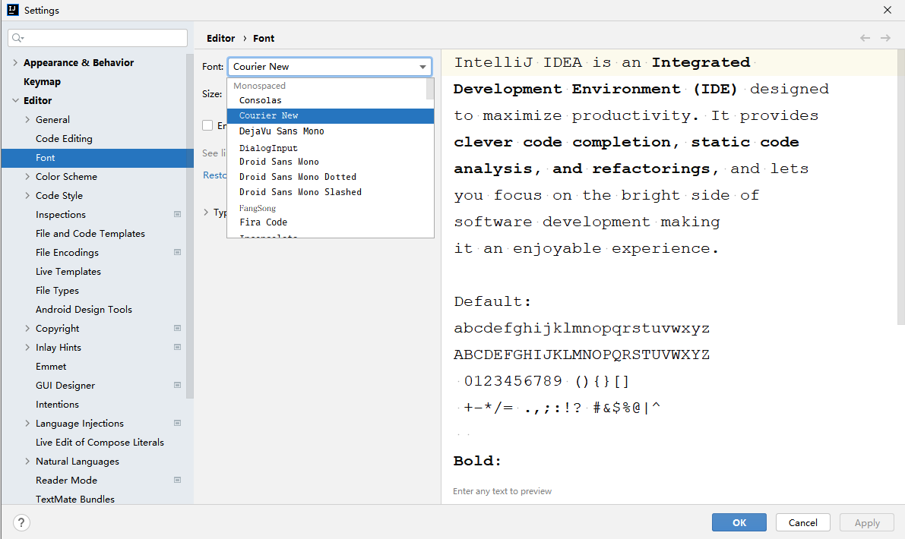
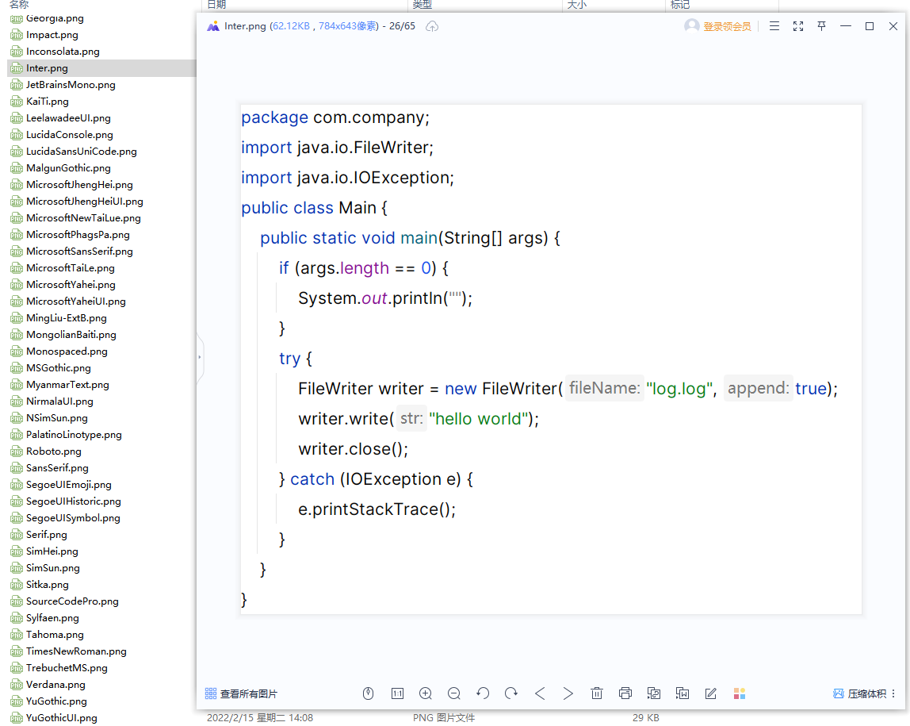
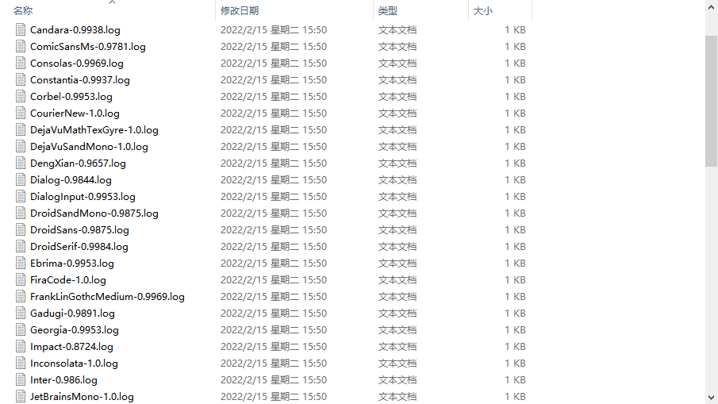

### 在OCR中存在着识别错误的情况，尤其是单独识别不是词或句子时候，比如`null`后边的`ll`，以下几个是最近遇到的：

`0 和 8`

`I 和 l`

`0 和 o`

`1 和 l`

`5 和 S`

### 试用了很多库或者收费的云服务也没办法区分，最近在开发自动化工具需要识别IntelliJ系列的编辑器中代码，发现每个字体都有识别不准的字符，而且还都不太一样，库方面准备使用`Tesseract-OCR`，先确定好字体然后再增强准确性吧，所以先在`IDEA`截图了肉眼能明显区分的近100种字体的代码截图





### 然后将原代码去除换行和空格转小写字母

```
packagecom.company;importjava.io.filewriter;importjava.io.ioexception;publicclassmain{publicstaticvoidmain(string[]args){if(args.length==0){system.out.println("");}try{filewriterwriter=newfilewriter(filename:"log.log",append:true);writer.write(str:"helloworld");writer.close();}catch(ioexceptione){e.printstacktrace();}}}
```

### 使用Tesseract提取出所有截图的代码为文件，去除换行和空格转小写字母与压缩的原代码比对相似度，图中文件名的数字为相似度



### awk命令拿出所有相似度100%的字体名

```
-rw-r--r-- 1 Administrator 197121 369  2月 15 15:58 Bahnschrift.txt
-rw-r--r-- 1 Administrator 197121 368  2月 15 15:59 Cambria.txt
-rw-r--r-- 1 Administrator 197121 369  2月 15 15:59 Consolas.txt
-rw-r--r-- 1 Administrator 197121 368  2月 15 15:59 Constantia.txt
-rw-r--r-- 1 Administrator 197121 373  2月 15 15:59 CourierNew.txt
-rw-r--r-- 1 Administrator 197121 370  2月 15 15:59 DejaVuMathTexGyre.txt
-rw-r--r-- 1 Administrator 197121 369  2月 15 15:59 DejaVuSandMono.txt
```

### 接着换了几个不同代码的截图测试了这7个字体，`Courier New`都为100%准确率，现在已经使用了一段时间，在词或句子识别都是100%，识别单独几个字母、特殊符号、下划线会出现问题，所以我这里做了一些后续的处理已经不会出现错误
