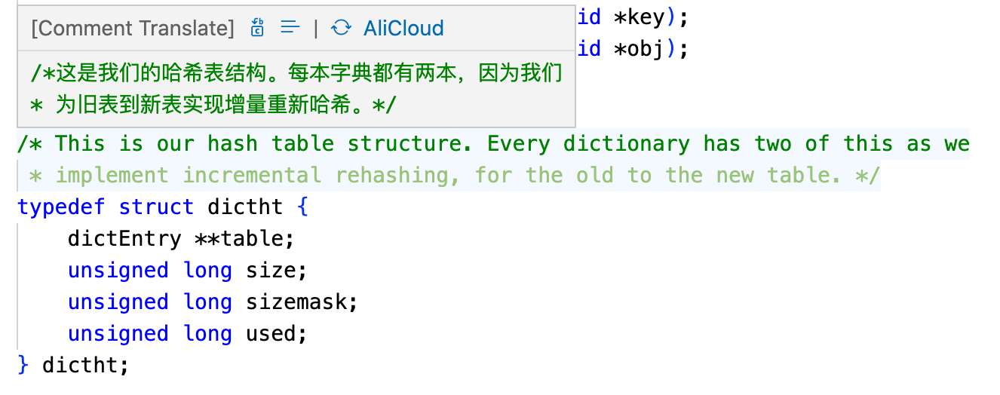
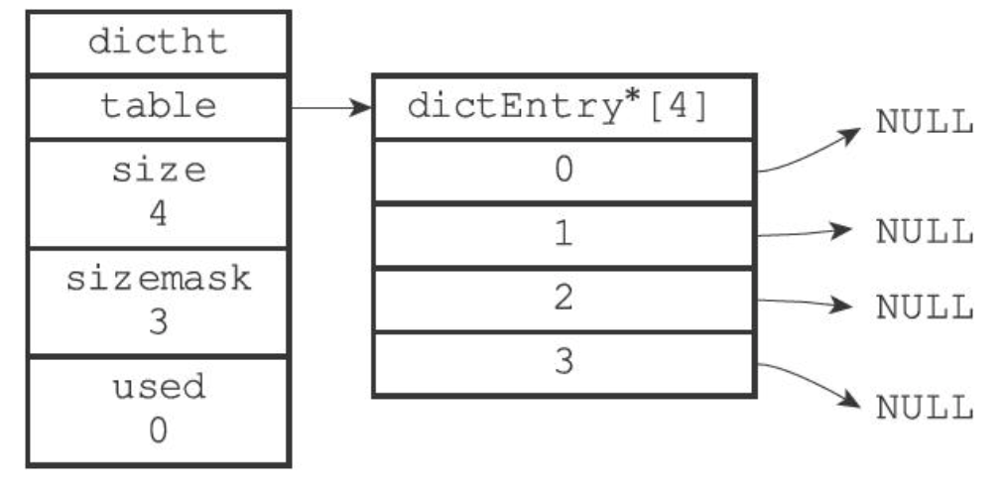

### 版本

redis 2.8.9

### 介绍

创建一个键值对时，底层保存在字典里。字典也是哈希键的底层实现之一（另一个是压缩列表）。哈希键里的键值对比较多，或者元素都是比较长的字符串时，Redis 会选用字典。

### 哈希表

Redis 用哈希表做字典的底层实现。一张哈希表里可以有多个节点，每个节点保存字典中的一个键值对。

Redis 字典用的哈希表由 `dict.h/dictht` 定义：



- `table` 是一个数组，每个元素指向一个 `dict.h/dictEntry`，每个 `dictEntry` 保存一个键值对。
- `size` 记录哈希表大小，也就是 `table` 数组的大小；`used` 记录当前已有节点（键值对）的数量。
- `sizemask` 的值总是等于 `size - 1`，它和哈希值一起决定键应该放到 `table` 的哪个索引上。

下图是一个大小为 4 的空哈希表（还没有任何键值对）：



### 哈希表节点

```c
typedef struct dictEntry {
    // 键
    void *key;
    // 值
    union {
        void *val;
        uint64_t u64;
        int64_t s64;
    } v;
    // 指向下个哈希表节点，形成链表
    struct dictEntry *next;
} dictEntry;
```

- `key` 保存键值对中的键，`v` 保存值。值可以是指针，也可以是 `uint64_t` 或 `int64_t`。
- `next` 指向另一个哈希表节点，把哈希值相同的键值对串成链表，用来解决键冲突（collision）。

### 字典

Redis 里的字典由 `dict.h/dict` 表示：

```c
typedef struct dict {
    // 类型特定函数
    dictType *type;
    // 私有数据
    void *privdata;
    // 哈希表
    dictht ht[2];
    // rehash索引，当rehash不在进行时，值为-1
    int rehashidx; /* rehashing not in progress if rehashidx == -1 */
    // 当前运行的迭代器数量
    int iterators; /* number of iterators currently running */
} dict;
```

- `type` 指向 `dictType`，里面是一簇操作特定类型键值对的函数。用途不同的字典，会设置不同的类型特定函数。
- `privdata` 保存需要传给那些函数的可选参数。
- `ht` 是包含两项的数组，每项都是一张 `dictht` 哈希表。一般情况下字典只用 `ht[0]`，`ht[1]` 只在对 `ht[0]` 做 rehash 时用。
- `rehashidx` 记录 rehash 进度，没在 rehash 时值为 `-1`。

### 哈希算法

```
# 使用字典设置的哈希函数，计算键 key 的哈希值
hash = dict->type->hashFunction(key);
# 使用哈希表的 sizemask 属性和哈希值，计算出索引值
# 根据情况不同，ht[x] 可以是 ht[0] 或者 ht[1]
index = hash & dict->ht[x].sizemask;
```

参考：MurmurHash 算法
