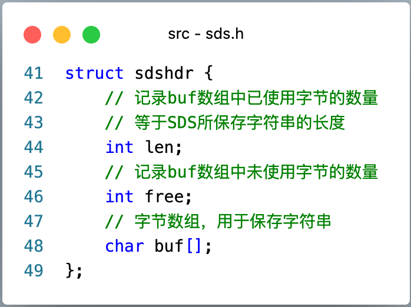
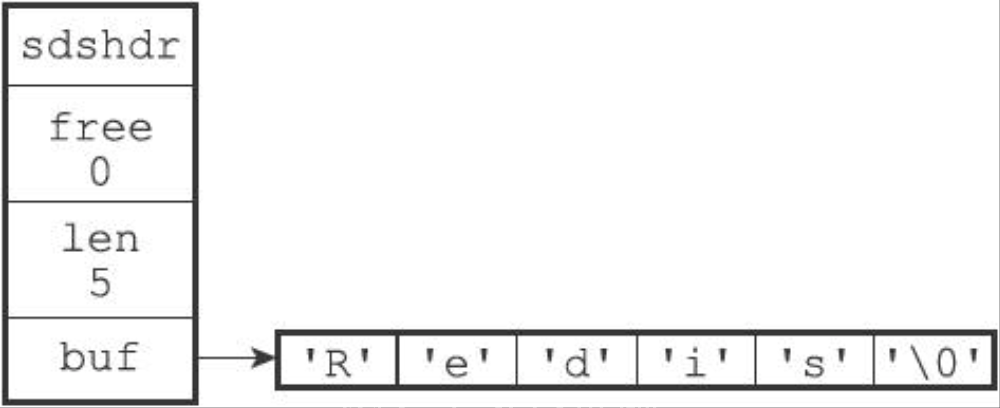

### 版本

redis 2.8.9

### 介绍

SDS，即 Simple Dynamic String，简单动态字符串。

Redis 没有直接使用 C 语言传统的字符串表示（以空字符结尾的字符数组），而是自己构建了一种名为简单动态字符串（simple dynamic string，SDS）的抽象类型，并把 SDS 当作 Redis 的默认字符串表示。

在 Redis 里面，C 字符串只会作为字符串字面量（string literal）用在一些无须修改字符串值的地方，比如打印日志。

当 Redis 需要的不只是字面量，而是可以修改的字符串值时，就会用 SDS，比如数据库里包含字符串值的键值对，底层都是 SDS。

### SDS 结构



### SDS 示例



> free 属性的值为 0，表示这个 SDS 没有分配任何未使用空间。
> len 属性的值为 5，表示这个 SDS 保存了一个五字节长的字符串。
> buf 属性是一个 char 类型的数组，数组的前五个字节分别保存了 `R`、`e`、`d`、`i`、`s` 五个字符，最后一个字节保存空字符 `'\0'`。

SDS 遵循 C 字符串以空字符结尾的惯例。保存空字符的 1 字节不计算在 len 里，为空字符多分配的 1 字节、以及把空字符加到末尾，都由 SDS 函数自动完成，对使用者是透明的。好处是 SDS 可以直接重用一部分 C 字符串库函数。

### SDS 与 C 字符串的区别

| C 字符串 | SDS |
| --- | --- |
| 不记录自身长度，获取长度是 `O(N)` | `len` 记下了长度，获取长度是 `O(1)` |
| 不记录长度，容易缓冲区溢出 | 修改前会自动扩容 |
| 每次增长或缩短都要重新分配内存 | 用未使用空间，把字符串长度和数组长度拆开 |
| 必须符合某种编码（如 ASCII），除末位外不能包含空字符，不能保存二进制 | 按二进制处理，不做限制和过滤 |
| 可以使用全部 `<string.h>` 函数 | 可以使用部分 `<string.h>` 函数 |

### 代码

```c
#ifndef __SDS_H
#define __SDS_H

#define SDS_MAX_PREALLOC (1024*1024)

#include <sys/types.h>
#include <stdarg.h>

typedef char *sds;

struct sdshdr {
    int len;
    int free;
    char buf[];
};

static inline size_t sdslen(const sds s) {
    struct sdshdr *sh = (void*)(s-(sizeof(struct sdshdr)));
    return sh->len;
}

static inline size_t sdsavail(const sds s) {
    struct sdshdr *sh = (void*)(s-(sizeof(struct sdshdr)));
    return sh->free;
}

sds sdsnewlen(const void *init, size_t initlen);
sds sdsnew(const char *init);
sds sdsempty(void);
size_t sdslen(const sds s);
sds sdsdup(const sds s);
void sdsfree(sds s);
size_t sdsavail(const sds s);
sds sdsgrowzero(sds s, size_t len);
sds sdscatlen(sds s, const void *t, size_t len);
sds sdscat(sds s, const char *t);
sds sdscatsds(sds s, const sds t);
sds sdscpylen(sds s, const char *t, size_t len);
sds sdscpy(sds s, const char *t);

sds sdscatvprintf(sds s, const char *fmt, va_list ap);
#ifdef __GNUC__
sds sdscatprintf(sds s, const char *fmt, ...)
    __attribute__((format(printf, 2, 3)));
#else
sds sdscatprintf(sds s, const char *fmt, ...);
#endif

sds sdstrim(sds s, const char *cset);
void sdsrange(sds s, int start, int end);
void sdsupdatelen(sds s);
void sdsclear(sds s);
int sdscmp(const sds s1, const sds s2);
sds *sdssplitlen(const char *s, int len, const char *sep, int seplen, int *count);
void sdsfreesplitres(sds *tokens, int count);
void sdstolower(sds s);
void sdstoupper(sds s);
sds sdsfromlonglong(long long value);
sds sdscatrepr(sds s, const char *p, size_t len);
sds *sdssplitargs(const char *line, int *argc);
sds sdsmapchars(sds s, const char *from, const char *to, size_t setlen);
sds sdsjoin(char **argv, int argc, char *sep);

/* Low level functions exposed to the user API */
sds sdsMakeRoomFor(sds s, size_t addlen);
void sdsIncrLen(sds s, int incr);
sds sdsRemoveFreeSpace(sds s);
size_t sdsAllocSize(sds s);

#endif
```
