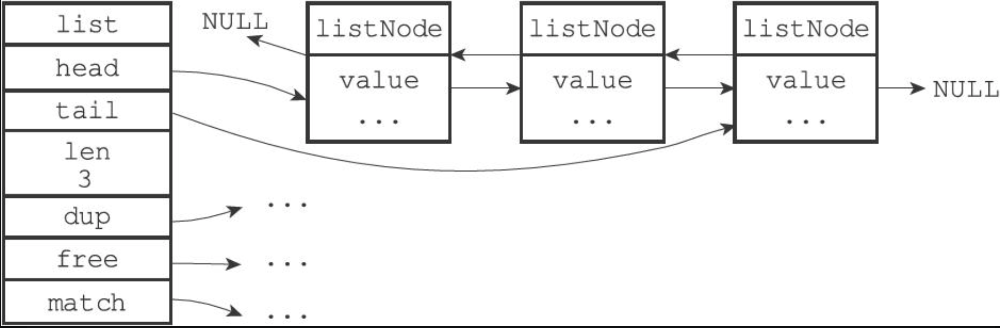

### 版本

redis 2.8.9

### 介绍

当前版本的 Redis 里，List 底层用 Ziplist 实现，之后的新版改用 `Quicklist`。

插入和删除很快，时间复杂度是 O(1)；按下标定位很慢，是 O(n)。

链表的前后指针 `prev` 和 `next` 会占不少内存。数据量少的时候，底层存成一块连续内存，叫 Ziplist（压缩列表）。

```shell
redis> object encoding test
ziplist
```

### 链表节点

每个链表节点是 `listNode`，多个 `listNode` 用双端链表串起来，用 `adlist.h/list` 来持有，操作更方便。

```c
/* adlist.h/listNode */
typedef struct listNode {
    struct listNode *prev;
    struct listNode *next;
    void *value;
} listNode;

/* adlist.h/list */
typedef struct list {
    /* 表头节点 */
    listNode *head;
    /* 表尾节点 */
    listNode *tail;
    /* 节点值复制函数 */
    void *(*dup)(void *ptr);
    /* 节点值释放函数 */
    void (*free)(void *ptr);
    /* 节点值对比函数 */
    int (*match)(void *ptr, void *key);
    unsigned long len;
} list;
```

### LIST 结构



### 场景

list 按插入顺序排，能用的地方不少，比如：

- 消息队列：`lpop` 和 `rpush`（或者反过来，`lpush` 和 `rpop`）就能当队列
- 朋友圈点赞列表、评论列表、排行榜：`lpush` 插入新元素，再用 `lrange` 读最新一段
