## 0x00 准备 MetaMask 钱包

Chrome 安装 MetaMask，注册两个钱包账户。

## 0x01 测试网水龙头申请测试币

钱包网络切到你的测试币网络，申请一些测试币。

## 0x02 Remix 部署合约

地址：`https://remix.ethereum.org`。部署顺序：工厂合约 → 路由合约 → PAIR 合约 → ERC20 合约。

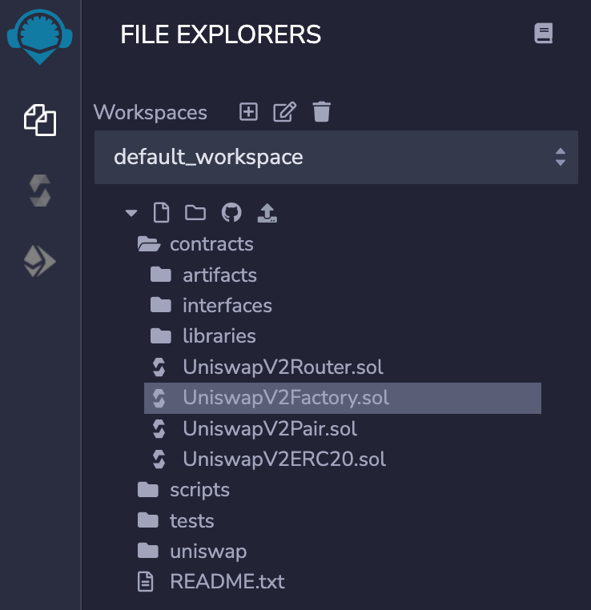

### 1、发布工厂合约

先编译通过，然后在发布页填入当前连接的钱包地址，点发布。

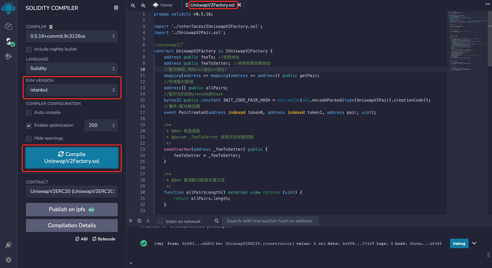

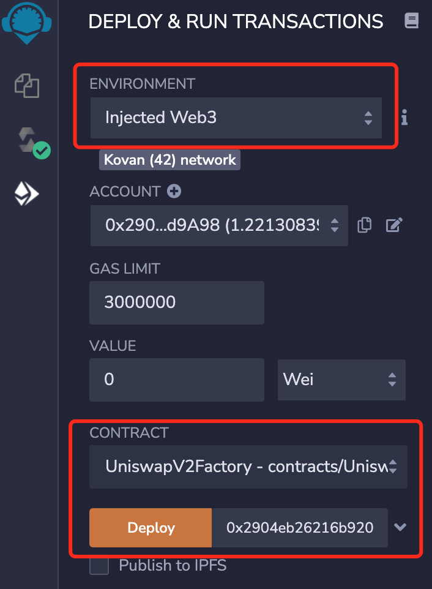

### 2、发布路由合约、PAIR 合约、ERC20 合约

编译通过后，填入工厂合约地址和对应的 WETH 合约地址再发布。PAIR 和 ERC20 同样操作。ENVIRONMENT 选 Injected Web3，CONTRACT 别选错。四个合约发布完，把合约地址复制保存好。

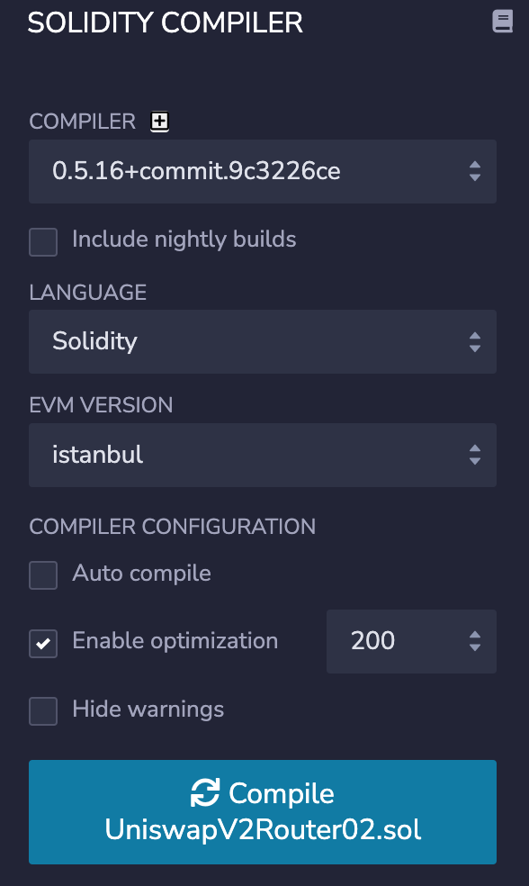

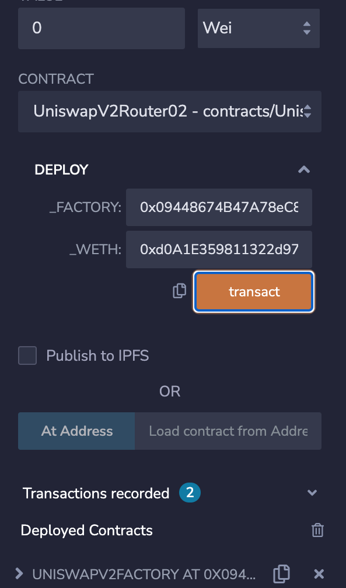

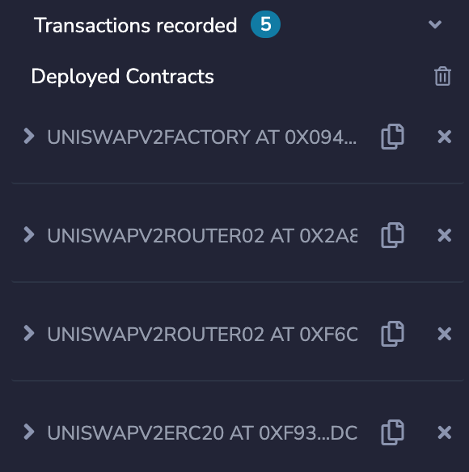

WETH 合约地址：

```
{
    mainnet:'0xC02aaA39b223FE8D0A0e5C4F27eAD9083C756Cc2',
    ropsten:'0xc778417E063141139Fce010982780140Aa0cD5Ab',
    rinkeby:'0xc778417E063141139Fce010982780140Aa0cD5Ab',
    goerli:'0xB4FBF271143F4FBf7B91A5ded31805e42b2208d6',
    kovan:'0xd0A1E359811322d97991E03f863a0C30C2cF029C'
}
```

### 4、代币名称和初始化转账

初始化转账写在 ERC20 的构造函数里：

```
_mint(msg.sender, 1000000000 * 10**18);
```

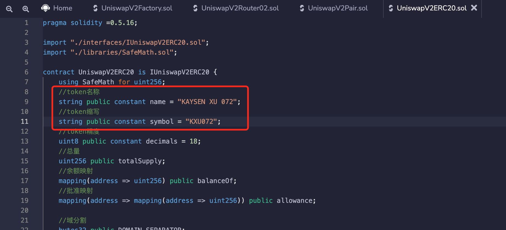

### 5、MetaMask 导入发布的代币

代币合约地址用 ERC20 地址。`KXU072` 就是刚发布的代币。

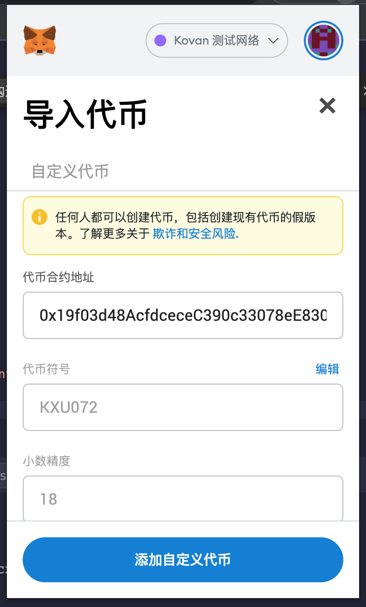

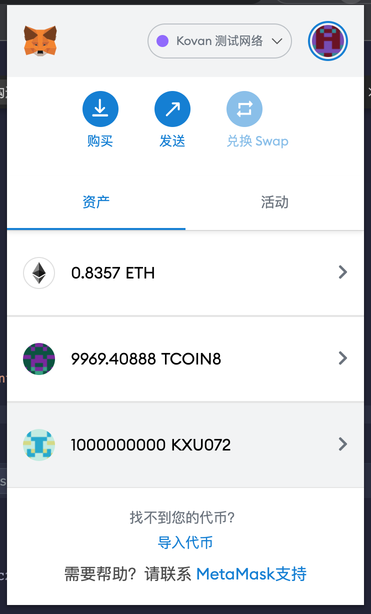

## 0x03 部署 Uniswap 前端

```
git clone https://github.com/Uniswap/uniswap-interface.git
cd uniswap-interface
yarn
```

接着改 `src/constants/addresses.ts` 里的路由合约地址。

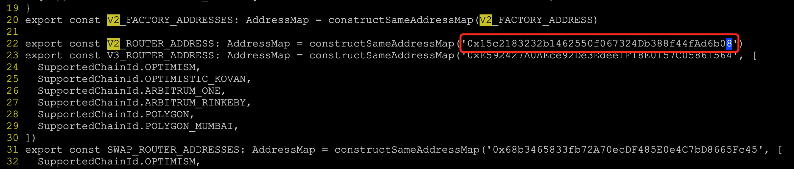

`yarn start` 启动服务，访问 3000 端口就是 Uniswap 界面。

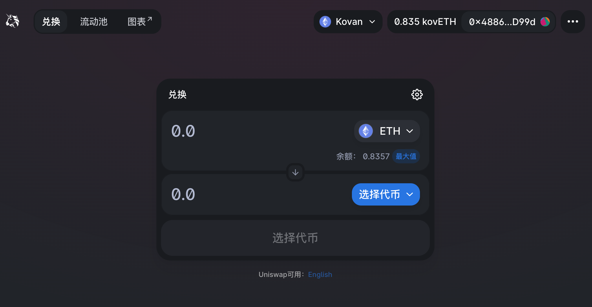

选择代币，粘贴 ERC20 合约地址，能看到刚发布的代币，以及初始化的数量。

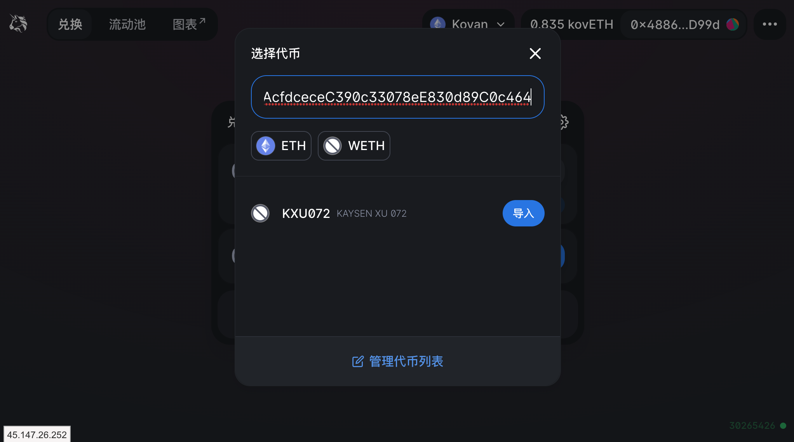

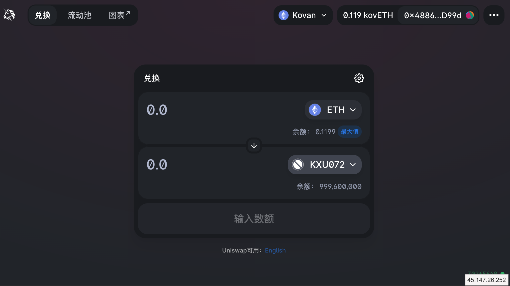

## 0x04 添加流动性

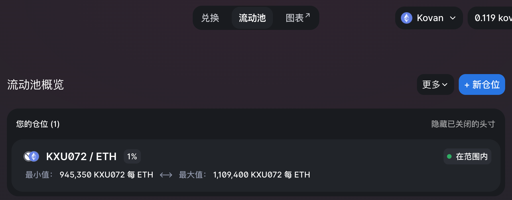

## 0x05 切换钱包账户

切换之后代币数量为 0。

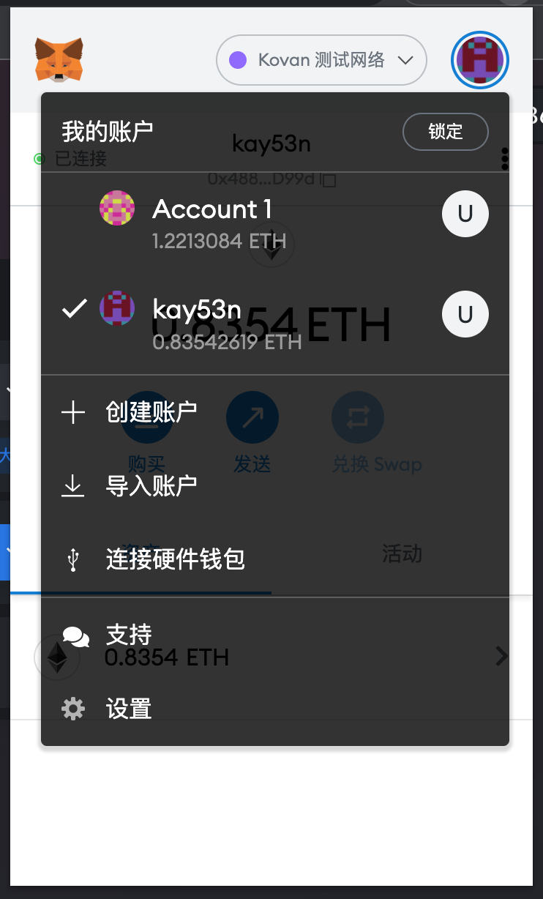

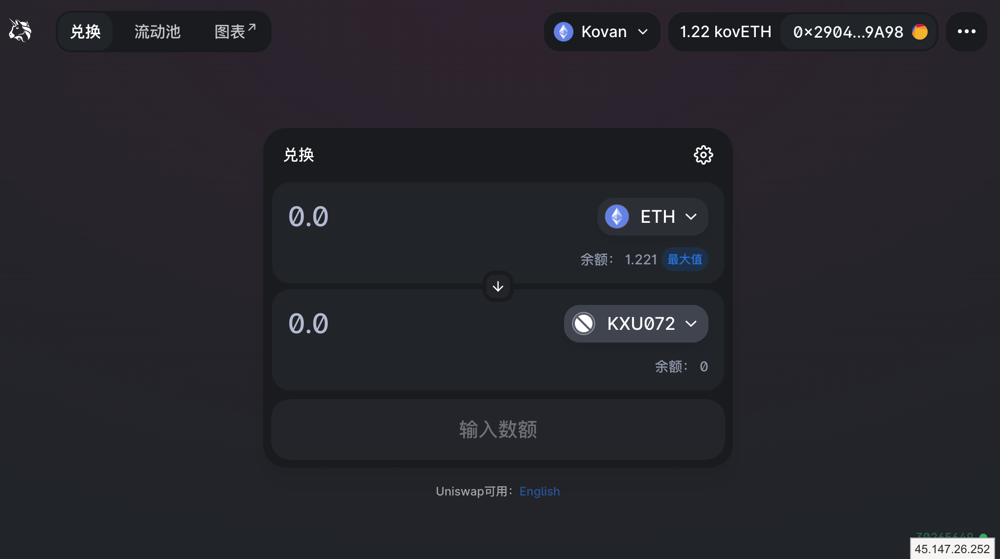

## 0x06 ETH 兑换代币

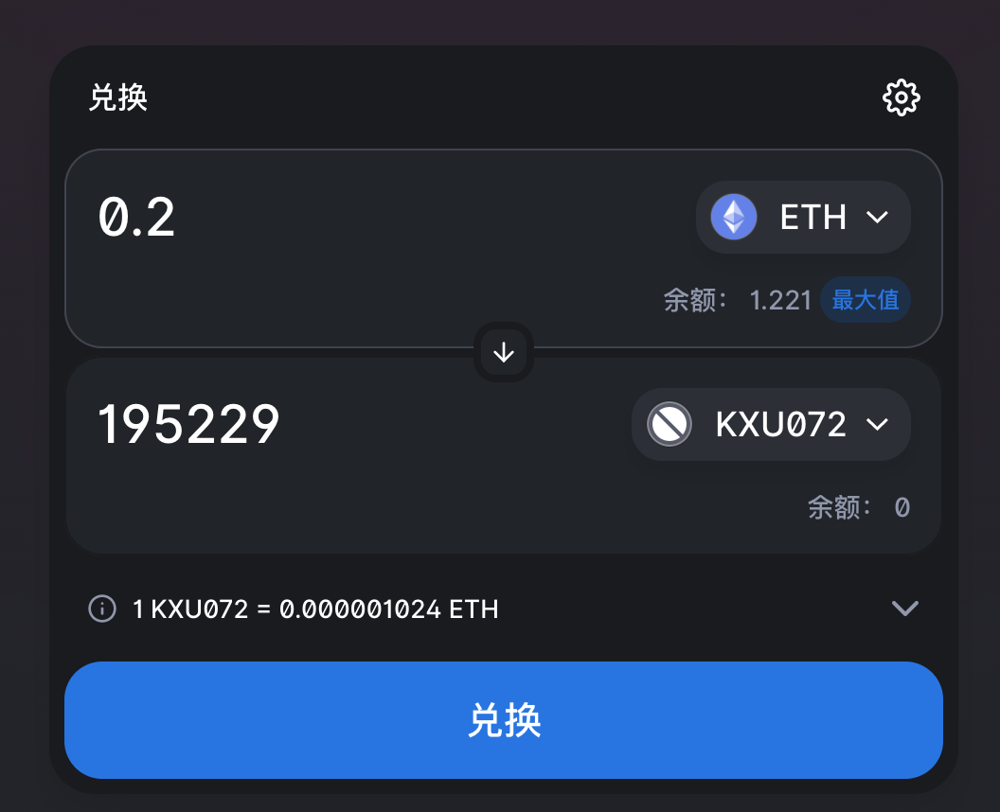

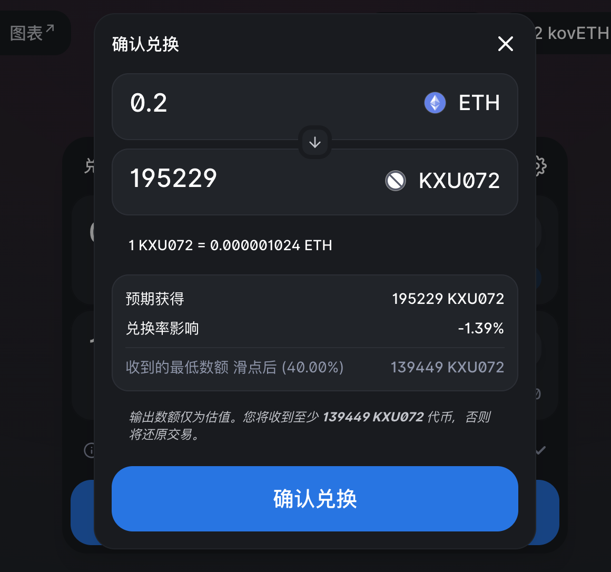
